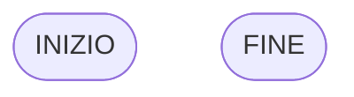
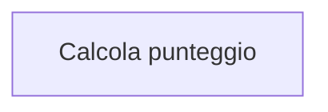
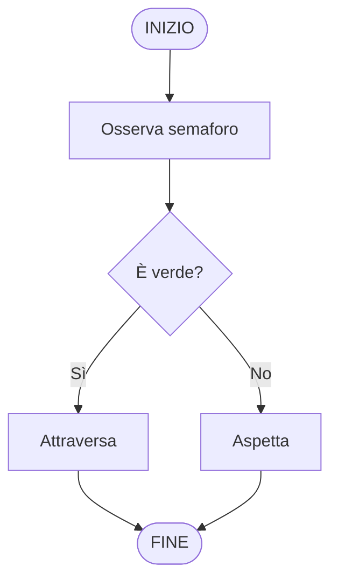

# I simboli dei diagrammi di flusso

Introduciamo i **simboli standard** dei diagrammi di flusso.

Questi simboli servono per rappresentare in modo chiaro e universale:

- l’inizio e la fine
- le azioni
- le decisioni
- il flusso di esecuzione

## I simboli principali

### 1. Inizio / Fine

Indica il punto di partenza o di arrivo dell’algoritmo. Si rappresenta con una forma arrotondata:

### 2. Azione (processo)

Rappresenta un’operazione da eseguire.

Esempi: apri un’app, muovi un personaggio, calcola un valore, assegna un punteggio

Si rappresenta con un rettangolo:

### 3. Decisione

Rappresenta una scelta, cioè una domanda con due sole possibili risposte.

Esempi: il semaforo è verde? il gioco si avvia? il nemico è presente?

Si rappresenta con un rombo:

### 4. Frecce (flusso)

Le frecce collegano i blocchi e indicano l’ordine delle operazioni.

## In sintesi

I diagrammi di flusso usano simboli standard per rappresentare:

l’inizio e la fine
le azioni
le decisioni
il flusso

## Esempio 

