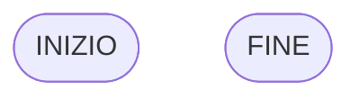

# I simboli dei diagrammi di flusso

Introduciamo i **simboli standard** dei diagrammi di flusso.

Questi simboli servono per rappresentare in modo chiaro e universale:

- l’inizio e la fine
- le azioni
- le decisioni
- il flusso di esecuzione

## I simboli principali

### 1. Inizio / Fine

Indica il punto di partenza o di arrivo dell’algoritmo.

In Mermaid si rappresenta con una forma arrotondata:

