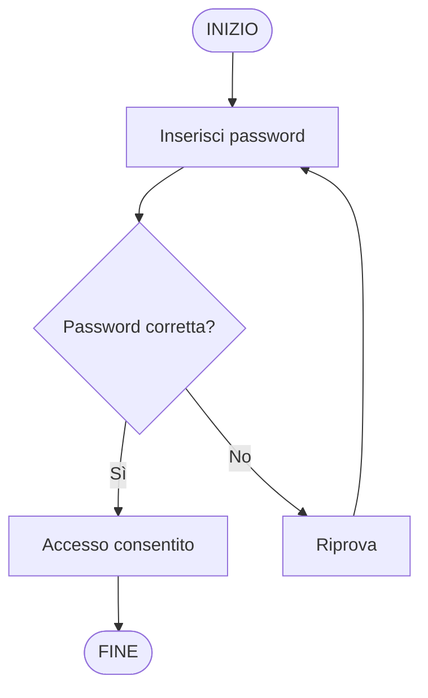
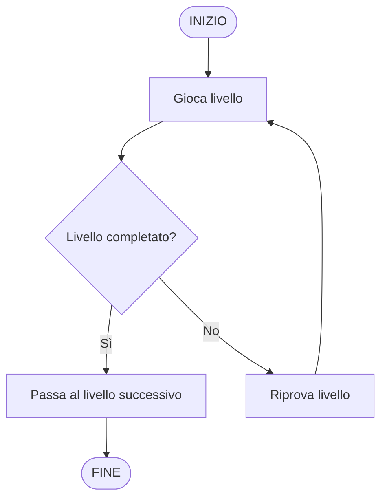
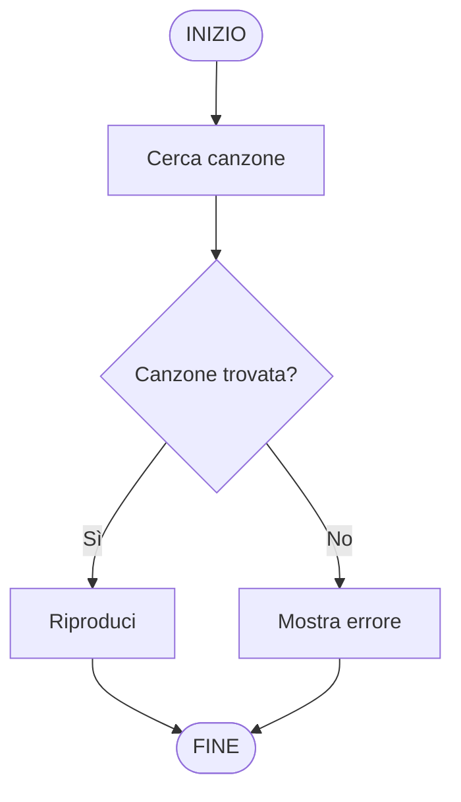
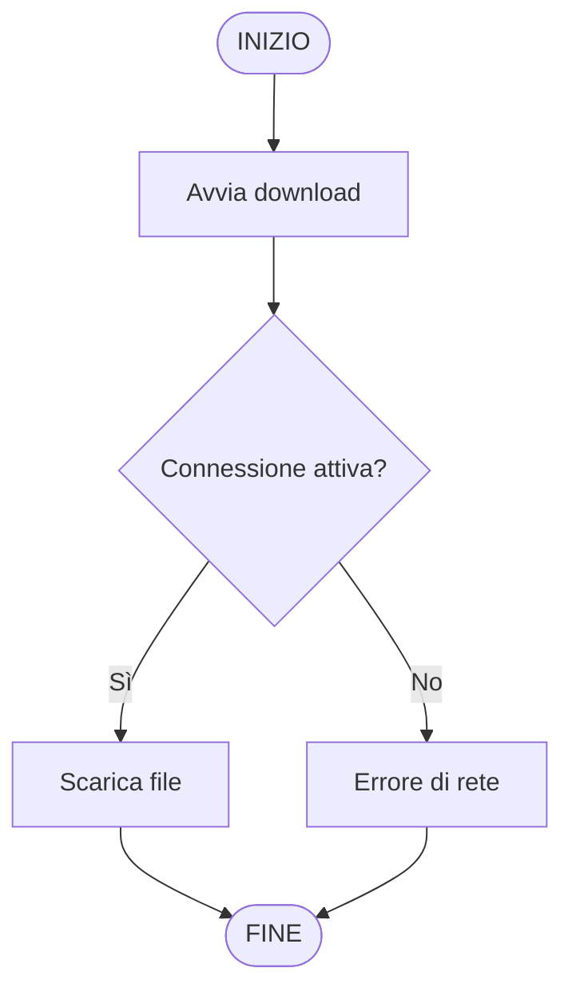

# Esempi di diagrammi di flusso

Vediamo alcuni esempi completi di diagrammi di flusso. L’obiettivo è capire come usare i simboli per rappresentare situazioni diverse.

## Esempio 1 — Accesso con password

Situazione: inserisci una password. Se è corretta accedi, altrimenti riprova.

## Esempio 2 — Livello in un videogioco

Situazione: completa un livello. Se vinci passi al successivo, altrimenti riprovi.

## Esempio 3 — Riproduzione musicale

Situazione: cerca una canzone. Se la trovi la riproduci, altrimenti mostri un errore.

## Esempio 4 — Download di un file

Situazione: avvia un download. Se la connessione è attiva scarichi il file, altrimenti mostri errore.

Cosa osservare:

In tutti gli esempi c’è un solo punto di inizio, ogni azione è chiara le decisioni hanno due uscite (Sì / No). il flusso è ordinato dall’alto verso il basso
In sintesi un diagramma di flusso serve a rappresentare un algoritmo in modo visivo, rendere chiari i passaggi ed evidenziare le decisioni.