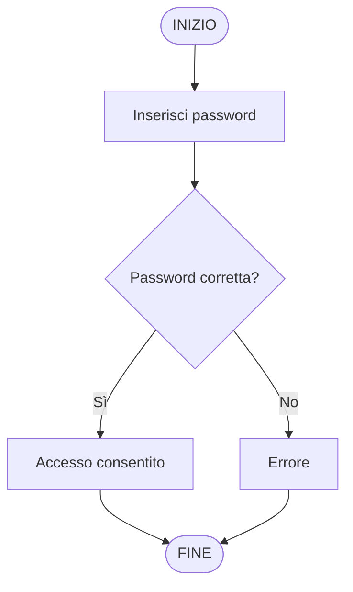
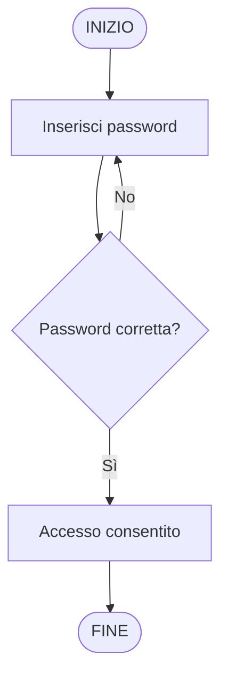
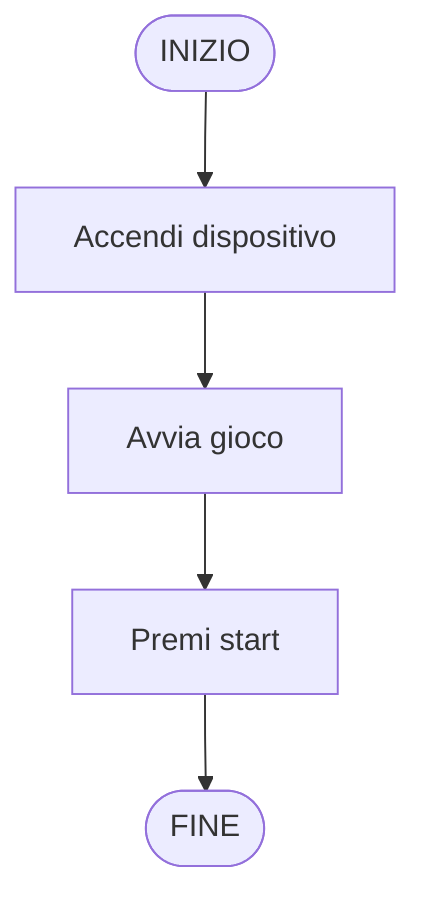

# Costruire un diagramma passo passo

Finora abbiamo visto esempi di diagrammi di flusso. Ma come si costruisce davvero un diagramma?

Non si parte dai simboli.
Si parte dal ragionamento.

## Metodo

Quando devi costruire un diagramma:

leggi il problema
individua cosa deve succedere
metti in ordine le azioni
individua le decisioni
verifica se qualcosa si ripete

Solo dopo si disegna il diagramma.

### Caso 1 — Una scelta

Situazione: inserisci una password. Se è corretta accedi, altrimenti compare un errore.

Ragionamento
l’utente inserisce una password
il sistema controlla se è corretta
ci sono due possibilità:
sì → accesso
no → errore

qui c’è una decisione

Schema

### Caso 2 — Una ripetizione

Situazione: inserisci una password finché è sbagliata.

Ragionamento: l’utente inserisce la password
il sistema controlla
se è sbagliata → si riprova
se è corretta → si entra

**qui qualcosa si ripete**

Schema

### Caso 3 — Solo sequenza

Situazione: avvia un videogioco e inizia a giocare.

Ragionamento
accendi il dispositivo
avvia il gioco
premi start

non ci sono scelte
non ci sono ripetizioni

Schema

Guardando questi esempi emergono tre situazioni diverse:

azioni in sequenza
decisioni (scelte)
ripetizioni

Queste tre situazioni compaiono in tutti i programmi.

## In sintesi

Per costruire un diagramma:

prima pensi
poi organizzi i passi
solo alla fine disegni
Prossimo passo

Le situazioni che abbiamo visto hanno un nome preciso.

sequenza
selezione
iterazione

e sono la base di tutti i programmi